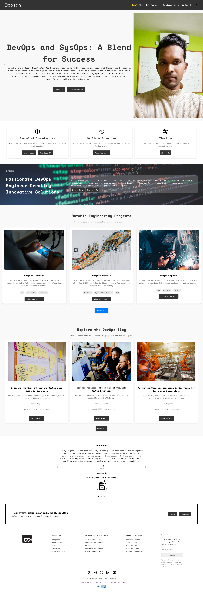
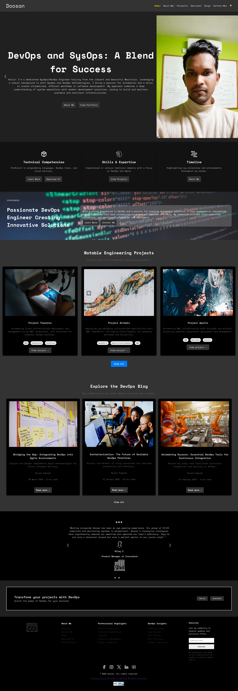
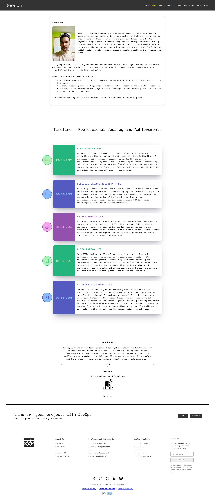
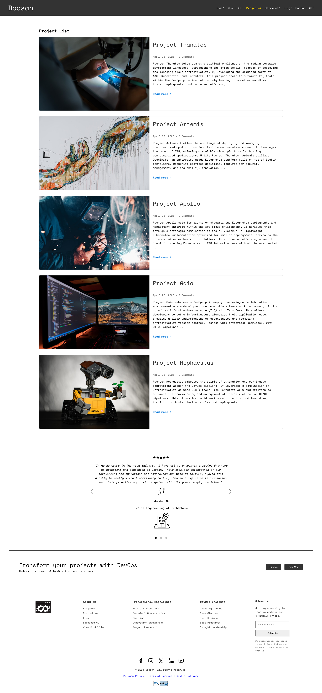
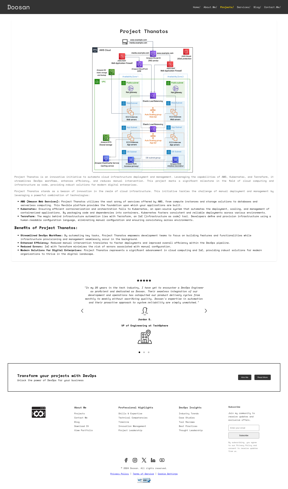
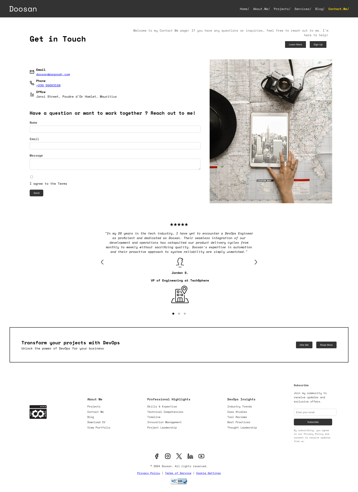

# README

Welcome to the README for the homepage layout of our DevOps and SysOps-themed website. Below you will find a detailed description of each section of the homepage. This guide aims to provide clarity on the design, functionality, and content of each part of the homepage.


---

## Accessing the Project on GitHub

**Accessing the Project on GitHub**

This project is hosted on GitHub and can be accessed through the following repository:

[**atlascopcosaurus/portfolio**](https://github.com/atlascopcosaurus/portfolio)

Feel free to explore the repository for source code, documentation, and other relevant project materials. Contributions, suggestions, and feedback are always welcome.

---

## Interactive Walkthrough

<iframe width="560" height="315" src="https://www.youtube.com/watch?v=4WZ77OGV9uw" title="Figma tutorial: Christmas Toggle" frameborder="0" allow="accelerometer; autoplay; clipboard-write; encrypted-media; gyroscope; picture-in-picture; web-share" allowfullscreen></iframe>


---
## Project Structure

```bash
[doosan@anton portfolio]$ tree .
.
├── assets
│   └── resume.pdf
├── contact-me
│   ├── 290144_building_office_finance buildings_icon.png
│   ├── 8666632_phone_icon.png
│   ├── 8666723_mail_icon.png
│   └── element5-digital-h9eOO7W5m2s-unsplash.jpg
├── css
│   ├── styles_1.css
│   ├── styles_3.css
│   ├── styles.css
│   └── styles_dark.css
├── html
│   ├── about-me.html
│   ├── contact-me.html
│   ├── project-article.html
│   └── projects.html
├── images
│   ├── blog-placeholder-1.jpg
│   ├── blog-placeholder-3.jpg
│   ├── blog-placeholder.jpg
│   ├── brightness.png
│   ├── building.png
│   ├── cloudnet.png
│   ├── Contact Me.png
│   ├── dark.png
│   ├── devops.png
│   ├── facebook.png
│   ├── icon-placeholder.png
│   ├── infra.png
│   ├── instagram.png
│   ├── insurance-company-2.png
│   ├── insurance-company.png
│   ├── left-arrow.png
│   ├── light-background.jpg
│   ├── linkedin.png
│   ├── location.png
│   ├── profile-pic-3.png
│   ├── profile-pic-5.png
│   ├── profile-pic-6.png
│   ├── profile-placeholder.png
│   ├── project-placeholder-1.jpg
│   ├── project-placeholder-2.jpg
│   ├── project-placeholder-3.jpg
│   ├── project-placeholder-4.jpg
│   ├── project-placeholder-5.jpg
│   ├── right-arrow.png
│   ├── skills.png
│   ├── terraform-logo.png
│   ├── timeline.png
│   ├── xing.png
│   └── youtube.png
├── index.html
├── js
│   ├── slider.js
│   ├── testimonial.js
│   ├── theme.js
│   └── validation.js
├── readme-images
│   ├── 255a341e2126.png
│   ├── 53cee40c9dab.png
│   ├── a519cbe97ffc.png
│   ├── a8655a4c06e4.png
│   ├── afb44587c674.png
│   ├── fa8a4a496769.png
│   └── homepage_decomposition.png
└── README.md

```

## Homepage Light Mode [index.html]



--- 

## Homepage Dark Mode 




#### Overview
The dark mode feature on the website is designed to enhance the user experience by offering an alternative, eye-friendly visual option that reduces glare, particularly useful in low-light conditions. This feature is currently implemented only on the `index.html` page of the website.

#### Implementation
- **Activation**: Users can enable dark mode by clicking on the sun icon located in the navigation bar. This interaction toggles the appearance of the website between light and dark themes.
- **Scope**: Due to time constraints, the dark mode feature has been limited to the homepage (`index.html`). Other pages will retain their default light theme until further updates are made.
- **Technical Details**: The toggle likely changes the CSS stylesheet from a light theme to a dark theme, adjusting the background colors, text colors, and potentially other elements like borders and shadows to fit the dark mode aesthetics.

#### User Interface
- **Icon**: The toggle is represented by a sun icon, which intuitively suggests brightness control.
- **Feedback**: Upon interaction, the icon may change to a moon or similar symbol to reflect the dark mode status, providing clear visual feedback that the mode has been activated.

#### Future Enhancements
- **Extension to Other Pages**: Plans to extend the dark mode feature to additional pages would offer a consistent user experience across the entire site.
- **User Preferences**: Integrating functionality to remember the user’s theme preference via cookies or local storage, so the preferred theme loads automatically on subsequent visits.

---


## Homepage Decomposition


#### A. Navigation Bar

- **Purpose**: Allows users to easily navigate the website.
- **Content**: Includes links to key sections: Home, About, Blog, Projects, Services, Blog, Contact, etc.
- **Features**: Fixed at the top, becomes sticky on scroll to remain accessible.

#### B. Image Slider Section

- **Purpose**: To showcase key highlights and recent achievements.
- **Content**: Features a rotating carousel of images that may include recent projects, team events, or key technology focuses.
- **Interaction**: Users can manually cycle through the images using navigation arrows.

#### C. Skills Section

- **Purpose**: Highlights professional skills and expertise.
- **Content**: Lists core skills such as programming languages, tools, and methodologies. Also includes a brief on experience level and specializations.
- **Design**: Icons and short progress bars or charts that visually represent proficiency levels.

#### D. Banner Section

- **Purpose**: Acts as a promotional space to emphasize professional identity.
- **Content**: A large, eye-catching banner stating "Passionate DevOps Engineer Creating Innovative Solutions".
- **Design**: Includes dynamic background or subtle animations to draw attention.

#### E. Projects Section

- **Purpose**: To display notable engineering projects.
- **Content**: Thumbnails for each project with a brief overview when hovered over. Links to detailed project pages.
- **Features**: 'View all' button to explore more projects.

#### F. Blog Section

- **Purpose**: To provide insights, updates, and articles on relevant topics.
- **Content**: Preview of blog posts with titles, brief descriptions, and publication dates.
- **Interaction**: Includes links to read more and view all blog entries.

#### G. Testimonial Section

- **Purpose**: To build trust by showcasing feedback from clients or colleagues.
- **Content**: Carousel of testimonials with quotes and attributions to the individuals.
- **Design**: Minimalistic with emphasis on readability and authenticity.

#### H. Call to Action Section

- **Purpose**: To encourage users to engage with services or contact for potential collaborations.
- **Content**: Features an impactful statement with a button, e.g., "Transform your projects with DevOps – Get in touch today!"
- **Design**: Prominent button and bold text to draw user attention.

#### I. Footer Section

- **Purpose**: Provides additional navigation and legal information.
- **Content**: Includes links to privacy policy, terms of service, social media icons, and a brief about section.
- **Design**: Organized and compact to avoid overwhelming users while providing useful links.


This README aims to be a comprehensive guide for anyone needing to understand or work on the homepage. Each section is designed to ensure a fluid user experience and provide valuable information clearly and efficiently.

---

## About Me 



### Overview
The "About Me" page is designed to offer a comprehensive view of Doosan Pagooah’s professional background, skills, and work philosophy. It integrates a blend of personal introductions, a detailed timeline of professional experiences, and endorsements, structured to engage visitors and provide a deep insight into his professional journey.

### Section Breakdown

#### 1. Introduction Section

- **Purpose**: Introduces Doosan Pagooah, highlighting his professional stance and approach.
- **Content Elements**:
  - **Portrait**: A professional photo of Doosan, establishing a personal connection with the visitor.
  - **Text Content**: A brief introduction that covers his passion for technology, his approach to DevOps and SysOps, and his key skills. This part emphasizes his problem-solving abilities and dedication to continuous learning and improvement.
  - **Design**: Clean and minimalistic, focusing on readability with a simple, elegant typography layout.

#### 2. Professional Journey and Achievements Timeline

- **Purpose**: Displays the chronological progression of Doosan's career, emphasizing significant achievements and roles.
- **Content Elements**:
  - **Timeline**: A vertical timeline that details each position held, along with the corresponding dates. Each entry includes a short description of his role and major accomplishments.
  - **Icons**: Custom icons next to each timeline entry that visually represent the nature of the job or sector (e.g., a gear icon for engineering roles).
  - **Interaction**: Users can scroll through the timeline, with each entry clearly delineated for easy reading.
  - **Design**: The timeline uses contrasting colors to distinguish between different roles and employs subtle animations as the user scrolls to enhance engagement.

#### 3. Testimonials

- **Purpose**: To build credibility through endorsements from colleagues and supervisors.
- **Content Elements**:
  - **Quotes**: Carousel of testimonials from various professionals acknowledging Doosan's expertise and contributions.
  - **Attribution**: Each quote includes the name, position, and company of the individual, adding authenticity to the testimonials.
  - **Design**: Testimonials are presented in a slider format, allowing users to navigate through them. The design is clean, with a focus on the text and subtle transitions between entries.

#### 4. Call to Action

- **Purpose**: Encourages visitors to engage further, whether through professional inquiries or project collaborations.
- **Content Elements**:
  - **Button**: A prominent button with "Transform your projects with DevOps" invites users to contact Doosan or learn more about his services.
  - **Design**: The button is designed to stand out, using a bold color that contrasts with the rest of the page, ensuring it catches the user's eye.

#### 5. Footer Section

- **Purpose**: Provides additional navigation and legal information along with social media links.
- **Content Elements**:
  - **Navigation Links**: Quick links to other parts of the website like Projects, Services, and Contact Me.
  - **Social Media Icons**: Links to Doosan’s professional social media profiles.
  - **Design**: Organized in a compact format, the footer remains consistent in style with the rest of the site to maintain a cohesive look.

#### Technologies Used

- **HTML**: For structuring the webpage.
- **CSS**: For styling, including layout, colors, and fonts.
- **JavaScript**: For interactive elements like the testimonial carousel.
- **Responsive Design**: Ensures the page is accessible and aesthetically pleasing across all devices.


This documentation should help in understanding the design and functionality of the "About Me" page, ensuring any future updates or modifications can be performed with an understanding of its initial intent and structure.

---


## Projects 



### Overview
The "Project List" page is designed to display an organized list of Doosan Pagooah's key projects, showcasing his expertise and contributions in the field of DevOps and SysOps. This page offers a detailed view of each project, highlighting its scope, technologies involved, and the challenges addressed.


#### 1. Project Overview Section

- **Purpose**: To introduce visitors to a range of projects completed by Doosan, emphasizing the diversity and depth of his work.
- **Content Elements**:
  - **Project Thumbnails**: Each project is represented by an image that reflects the project's nature or outcome.
  - **Project Descriptions**: Brief descriptions for each project that outline the objectives, technologies used, and the impact of the project.
  - **Read More Links**: Each project summary includes a 'Read more' link that directs users to a detailed project page.
  - **Design**: The section is designed with a clean, grid layout that aligns images and text neatly for easy navigation and a visually appealing presentation.

#### 2. Detailed Project Entries

- **Purpose**: Provides a snapshot of each project to engage the visitor and encourage deeper exploration.
- **Content Elements**:
  - **Date and Comments**: Each project entry displays the completion date and the number of comments to indicate engagement.
  - **Technologies Highlight**: Icons or small graphics may represent the key technologies involved in each project, providing a quick visual reference.
  - **Interaction**: Users can interact with each project entry by clicking on the 'Read more' link or the project image to navigate to the full project article.

#### 3. Testimonials

- **Purpose**: To bolster credibility and showcase the real-world impact of Doosan's work through endorsements from colleagues and clients.
- **Content Elements**:
  - **Carousel Format**: Testimonials are presented in a slider format to maximize space and maintain user interest.
  - **Client Quotes**: Each testimonial includes a quote highlighting the client's experience with the project and Doosan's contributions.
  - **Client Details**: Attribution includes the client's name and title, enhancing the authenticity of the testimonial.
  - **Design**: The testimonial section is styled minimally to focus attention on the text, using subtle transitions between slides.

#### 4. Call to Action

- **Purpose**: Encourages users to engage with Doosan for future projects or consultations.
- **Content Elements**:
  - **Engagement Button**: A prominent button, such as "Hire Me" or "Request Quote", is placed to prompt direct action from potential clients or collaborators.
  - **Design**: The button is visually distinct and placed strategically to catch the user's attention after reviewing the projects.

#### 5. Footer Section

- **Purpose**: Provides additional navigation and essential information such as links to privacy policies and social media profiles.
- **Content Elements**:
  - **Navigation Links**: Links to other pages like About, Services, and Contact, facilitating easy movement across the website.
  - **Social Media Icons**: Quick access to Doosan’s professional profiles for further engagement.
  - **Design**: Continues the clean and organized theme of the website, ensuring consistency across all pages.

### Technologies Used

- **HTML**: Structures the webpage content.
- **CSS**: Styles the layout, including grid formats, color schemes, and typography.
- **JavaScript**: Enhances interactivity, especially in the carousel and navigation links.
- **Responsive Design**: Ensures the page is accessible and functional across all devices, from desktops to smartphones.


This documentation serves as a comprehensive guide for maintaining or updating the "Project List" page. It aims to ensure that the design intent and functionality are preserved and that any future enhancements align with the established user experience strategy.

---

## Project Article Mode



## Overview
The "Project Thanatos" page is dedicated to showcasing a significant project in Doosan Pagooah’s portfolio that focuses on automating cloud infrastructure development and management using cutting-edge technologies like AWS, Kubernetes, and Terraform. This page provides an in-depth look at the project's architecture, technologies, benefits, and strategic importance.

### Section Breakdown

#### 1. Project Introduction Section

- **Purpose**: Introduces the project, providing a high-level overview of its goals and technological framework.
- **Content Elements**:
  - **Project Title**: Clearly displays the name 'Project Thanatos'.
  - **Overview Description**: Summarizes the project’s objective, which is to automate cloud infrastructure deployment and management, thereby reducing manual intervention and improving efficiency.
  - **Technological Diagram**: Includes a detailed architectural diagram illustrating how various AWS services are integrated with Kubernetes and managed through Terraform scripts.
  - **Design**: The section uses a clean layout with a professional tone. The diagram is central and is supplemented by minimal text to maintain focus on the visual explanation.

#### 2. Detailed Project Description

- **Purpose**: Delivers detailed information about the project, explaining how it was implemented and the specific technologies involved.
- **Content Elements**:
  - **Technological Details**: Explains the role of AWS, Kubernetes, and Terraform in the project, detailing how each contributes to the project's success.
  - **Functionality Highlights**: Describes key functionalities such as automated scaling, deployment, and management of infrastructure.
  - **Design**: Text is structured in concise paragraphs with bullet points for clearer understanding of complex technical processes.

#### 3. Benefits of Project Thanatos

- **Purpose**: Articulates the tangible benefits derived from the project, reinforcing the value brought to the organization.
- **Content Elements**:
  - **Enhanced Efficiency**: Discusses how the project enhances operational efficiency by automating routine tasks.
  - **Reduced Errors**: Highlights the reduction in manual configuration errors thanks to standardized scripts.
  - **Modern Solutions for Digital Enterprises**: Positions Project Thanatos as a model for modern cloud-based architectures.
  - **Design**: The benefits are listed in a clear, easily digestible format, possibly using icons or small graphics to visually represent each benefit.

#### 4. Call to Action

- **Purpose**: Encourages users to engage with Doosan for similar projects or consultations.
- **Content Elements**:
  - **Engagement Button**: Features buttons like “Hire Me” or “Consult for Your Project”, motivating visitors to initiate contact for potential collaborations.
  - **Design**: Visually compelling buttons that stand out against the page’s background, drawing the user's attention after reading about the project’s success.

### Technologies Used

- **HTML5**: For structuring the content of the page.
- **CSS3**: For styling, ensuring the page is visually appealing and aligns with the overall design theme of the website.
- **JavaScript**: Possibly used for interactions, especially if there are elements like collapsible sections for detailed descriptions.
- **SVG or Canvas**: For rendering the detailed architecture diagram to ensure it is scalable and responsive.

This documentation provides a clear guide for maintaining or enhancing the "Project Thanatos" page. It ensures that the design intent and technical descriptions are well understood, aiding in consistent updates and potential expansions of the content.

--- 

## Contact Me 


The "Contact Me" page on your website is thoughtfully designed to facilitate communication between you and potential clients, collaborators, or anyone interested in reaching out. Here’s a detailed overview of the various elements and functionalities of this page:

### Overview
The "Contact Me" page serves as a direct communication channel, inviting users to connect with you through various methods such as email, phone, or a detailed contact form. The design is clean and user-friendly, ensuring that visitors can easily find contact information and submit inquiries.

### Detailed Section Breakdown

#### Navigation Bar
- **Functionality**: Consistent with other pages, it includes links to Home, About Me, Projects, Services, Blog, and Contact Me. The 'Contact Me' link is highlighted as active to indicate the current page.
- **Design**: Simplistic and clean, matching the overall website aesthetic.

#### Contact Information
- **Layout**: The contact details are divided into distinct sections for Email, Phone, and Physical Address, making it easy to locate essential information.
- **Interactive Elements**: Each mode of contact (email, phone, office) is accompanied by an icon and is clickable, leading directly to the intended action (e.g., initiating a phone call or composing an email).

#### Contact Form
- **Fields Included**: Name, Email, and Message fields, all required to ensure that you receive sufficient information to respond appropriately.
- **Functionality**: Includes validation to check that the information entered is in the correct format before submission.
- **Privacy**: A checkbox for users to agree to the terms of communication, ensuring compliance with data protection regulations.

#### Call to Action Buttons
- **Purpose**: Positioned at the top of the page, these buttons ('Learn More' and 'Sign Up') are intended to guide users to more informational resources or to engage with your services.

#### Design and Usability
- **Visuals**: The page uses a clean layout with plenty of white space to ensure that the information is easy to read and the form is straightforward to use.
- **Responsiveness**: The page layout adjusts smoothly across different devices, ensuring that it is functional on desktops, tablets, and smartphones.

#### Testimonials (optional section if included)
- **Engagement**: While not focused on in this description, if included, testimonials can add a layer of trust by sharing positive experiences from past clients or collaborators.

#### Footer
- **Comprehensive Links**: Includes links to various sections of the website such as About Me, Projects, Blog, etc., enhancing navigation.
- **Social Media Icons**: Direct links to your social media profiles, encouraging visitors to connect with you on these platforms.
- **Legal Links**: Offers easy access to your privacy policy, terms of service, and cookie settings.

Overall, the "Contact Me" page is designed to be welcoming and efficient, encouraging users to communicate with ease while providing them with multiple options to do so. This approach not only enhances user experience but also fosters professional connections.